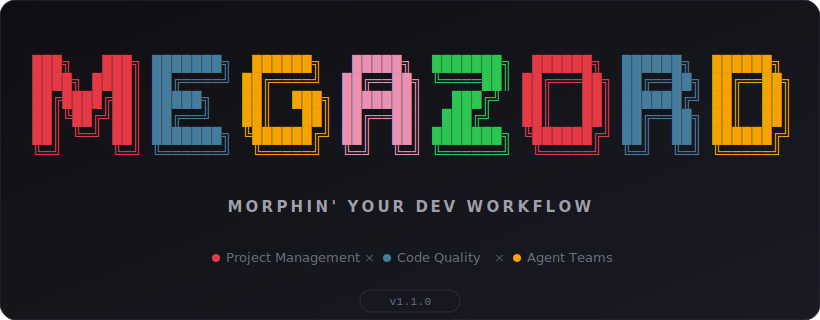
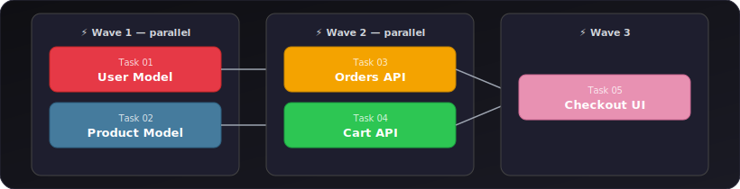
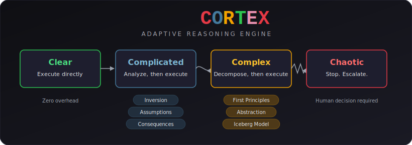

<p align="center">
  
</p>

<p align="center">
  <strong>Project management, code quality, and multi-agent coordination in a single Claude Code plugin.</strong>
</p>

<p align="center">
  <a href="https://www.npmjs.com/package/megazord-cli"></a>
  <a href="https://github.com/sh3rd3n/megazord/actions"></a>
  <a href="LICENSE"></a>
  <a href="https://nodejs.org/">= 22"></a>
  <a href="https://claude.ai/code"></a>
  
</p>

<p align="center">
  <code>bunx megazord-cli</code>
</p>

<p align="center">
  <a href="#why-megazord">Why Megazord</a> &middot;
  <a href="#how-it-works">How It Works</a> &middot;
  <a href="#cortex">CORTEX</a> &middot;
  <a href="#commands">Commands</a> &middot;
  <a href="#why-it-works">Why It Works</a> &middot;
  <a href="#configuration">Configuration</a>
</p>

---

## Why Megazord

Other Claude Code frameworks fall into two camps. **Workflow tools** (like Superpowers) give you code quality discipline -- TDD, brainstorming, code review -- but don't help you manage a project across phases and milestones. **Project management tools** (like GSD) give you roadmaps, planning, and context engineering -- but leave code quality to chance.

Megazord combines both. One plugin that covers the full development lifecycle: from "what should I build?" all the way to "it's built, reviewed, verified, and shipped."

And unlike other frameworks where agents are spawned, do their job, and disappear -- Megazord is built on Claude Code's **native Agent Teams**. Your agents actually communicate with each other, coordinate through a shared task list, and hand off context in real time. No file-based workarounds. No fire-and-forget subagents. Real multi-agent coordination.

---

## Who This Is For

Developers who use Claude Code and want their AI-assisted workflow to feel like a coordinated team instead of a solo assistant. Whether you're building a new project from scratch or adding features to an existing codebase, Megazord gives you structure without bureaucracy.

---

## Getting Started

### Prerequisites

- **[Claude Code](https://claude.ai/code)** >= 2.x
- **[Node.js](https://nodejs.org/)** >= 22
- **[bun](https://bun.sh/)** (any recent version)

### Install

```bash
bunx megazord-cli
```

This registers Megazord as a Claude Code plugin. Restart Claude Code to activate.

<details>
<summary><strong>Other install commands</strong></summary>

```bash
# Update to latest version
bunx megazord-cli update

# Uninstall
bunx megazord-cli uninstall
```

</details>

### Your first project

**1. Initialize**

```
/mz:init
```

Megazord asks about your project, picks a quality preset, and creates the planning structure.

**2. Plan your first phase**

```
/mz:plan 1
```

Researches the technical landscape, then decomposes the phase into tasks with dependencies and execution waves.

**3. Build it**

```
/mz:go
```

Spawns specialized agents that execute tasks in dependency order, commit atomically, and coordinate through Agent Teams.

**4. Verify it works**

```
/mz:verify
```

Checks that what was built actually matches your acceptance criteria -- not just "did tasks complete" but "did we build what we said we'd build."

---

## How It Works

### 1. Initialize Project

```
/mz:init
```

One command, one flow. The system:

1. **Questions** -- asks until it understands your project completely (goals, constraints, tech stack, edge cases)
2. **Preset selection** -- Strict, Balanced, or Minimal quality gates
3. **Deep context** -- captures your vision, requirements, and non-goals
4. **Planning structure** -- creates PROJECT.md, STATE.md, ROADMAP.md, and config

You approve the setup. Now you're ready to build.

**Creates:** `.planning/megazord.config.json`, `PROJECT.md`, `STATE.md`, `ROADMAP.md`

> **Already have code?** Run `/mz:map` first. It spawns parallel agents to analyze your stack, architecture, conventions, and concerns. Then `/mz:init` and `/mz:plan` know your codebase -- planning automatically loads your existing patterns.

---

### 2. Discuss Phase (optional)

```
/mz:discuss "Should we use JWT or session-based auth?"
```

**This is where you shape the implementation.**

Your roadmap has a sentence or two per phase. That's not enough context to build something the way *you* imagine it. This step captures your preferences before anything gets researched or planned.

Megazord identifies gray areas, asks Socratic questions, explores 5+ approaches, and records your decisions. The output feeds directly into research and planning.

**Creates:** `CONTEXT.md`

---

### 3. Plan Phase

```
/mz:plan 1
```

The system:

1. **Researches** -- investigates how to implement this phase, guided by your decisions
2. **Plans** -- creates task breakdown with dependencies and execution waves
3. **Verifies** -- checks plans against requirements, loops until they pass

Each plan is structured so agents can execute independently with clear boundaries.

**Creates:** `RESEARCH.md`, `PLAN.md`

---

### 4. Execute Phase

```
/mz:go
```

The system:

1. **Runs tasks in waves** -- parallel where independent, sequential when dependent
2. **Spawns specialized agents** -- each task gets an executor with fresh context
3. **Commits per task** -- every completed task gets its own atomic commit
4. **Coordinates via Agent Teams** -- agents communicate, hand off context, and build on each other's work

Walk away, come back to completed work with clean git history.

**How wave execution works:**

<p align="center">
  
</p>

Independent tasks run in parallel within each wave. Waves run sequentially -- Wave 2 waits for Wave 1 to finish.

**Creates:** `SUMMARY.md`, `VERIFICATION.md`

---

### 5. Verify and Review

```
/mz:verify
/mz:review
```

**Verify** checks that deliverables match your acceptance criteria. Goal-backward: "did we build what we promised?"

**Review** runs a two-stage code review: spec compliance first, then code quality. Findings are severity-graded -- critical issues block progress.

---

### 6. Repeat, Complete, Next Milestone

```
/mz:plan 2 → /mz:go → /mz:verify → ...
/mz:lifecycle
```

Loop **discuss/plan/execute/verify** until milestone complete. Then `/mz:lifecycle` audits deliverables, archives the milestone, tags the release, and prepares the next version.

---

### Quick Mode

```
/mz:quick "Add dark mode toggle to settings page"
```

For tasks that don't need full planning. Same quality guarantees (atomic commits, state tracking), faster path. No research, no plan checker, no verifier -- just get it done.

---

## CORTEX

> *The adaptive reasoning engine that makes agents think before they act.*

Most AI coding tools treat every task the same. A variable rename gets the same cognitive process as a distributed authentication system. That's wasteful at the bottom and dangerous at the top.

CORTEX classifies every task through **Cynefin complexity domains** -- Clear, Complicated, Complex, Chaotic -- and scales analysis to match actual risk. Clear tasks execute instantly with zero overhead. Complicated tasks get structured challenge analysis. Complex tasks trigger full decomposition before a single line of code is written. Chaotic situations stop execution entirely and escalate to the human.

<p align="center">
  
</p>

### Thinking Frameworks

| Domain | Framework | What It Prevents |
|--------|-----------|-----------------|
| Complicated+ | Inversion (Pre-mortem) | Building something that fails in predictable ways |
| Complicated+ | Ladder of Inference | Acting on unverified assumptions |
| Complicated+ | Consequence Tracing | Missing second and third-order effects |
| Complex | First-Principles Decomposition | Borrowing solutions that don't fit |
| Complex | Abstraction Laddering | Solving the wrong problem |
| Complex | Iceberg Model | Treating symptoms instead of structural causes |
| Recurring | Issue Tree | Debugging without structure |

<details>
<summary><strong>Inversion (Pre-mortem)</strong></summary>

Before writing code, assume the implementation has already failed. Generate three specific failure scenarios:

1. *"This fails when..."* -- not vague risks, but concrete failure paths
2. Trace each scenario to its root cause
3. Decide: proceed, modify approach, or reject entirely

This catches architectural mistakes at the whiteboard, not in production.

</details>

<details>
<summary><strong>First-Principles Decomposition</strong></summary>

For Complex tasks, CORTEX prevents agents from pattern-matching to familiar solutions that don't fit. Instead:

1. Strip the problem to its irreducible constraints
2. Identify the fundamental truths that must hold
3. Build up from those truths -- not down from existing patterns

This is the difference between "how did someone else solve this?" and "what does *this problem* actually require?"

</details>

<details>
<summary><strong>Iceberg Model</strong></summary>

When agents encounter recurring issues, CORTEX forces analysis below the surface:

- **Events:** What happened? *(visible)*
- **Patterns:** What keeps happening? *(trend)*
- **Structures:** What system produces this pattern? *(cause)*
- **Mental models:** What assumptions sustain the structure? *(root)*

Fixing events is a band-aid. Fixing mental models prevents entire categories of bugs.

</details>

This isn't bolted on as a post-hoc review -- it's wired into the executor's decision loop. Every non-trivial choice goes through CORTEX before code is written.

---

## Commands

### Core Workflow

| Command | What it does |
|---------|-------------|
| `/mz:init` | Initialize project: questions, preset selection, planning structure |
| `/mz:discuss` | Socratic brainstorming to explore approaches before planning |
| `/mz:plan [N]` | Research + plan + verify for a phase |
| `/mz:go` | Execute phase plan with Agent Teams coordination |
| `/mz:verify` | Goal-backward verification against acceptance criteria |
| `/mz:review` | Two-stage code review (spec compliance + code quality) |
| `/mz:lifecycle` | Audit milestone, archive, tag release, start next version |

### Navigation

| Command | What it does |
|---------|-------------|
| `/mz:status` | Where am I? What's next? |
| `/mz:help` | Show all commands with usage examples |

### Brownfield

| Command | What it does |
|---------|-------------|
| `/mz:map` | Analyze existing codebase (tech, architecture, conventions, concerns) |

### Session Management

| Command | What it does |
|---------|-------------|
| `/mz:pause` | Save session context for handoff to future session |
| `/mz:resume` | Restore context and continue from where you left off |

### Utilities

| Command | What it does |
|---------|-------------|
| `/mz:settings` | View and modify project configuration |
| `/mz:quick` | Execute ad-hoc task with quality guarantees, skip full ceremony |
| `/mz:debug` | Systematic four-phase debugging (reproduce, isolate, root-cause, fix) |

---

## Why It Works

### Native Agent Teams

Most Claude Code frameworks spawn subagents with the Task tool -- fire and forget. The orchestrator sends work out, collects results, moves on. Agents never talk to each other.

Megazord uses Claude Code's built-in Agent Teams: `TeamCreate`, `SendMessage`, `TaskList`, `TaskUpdate`. Agents coordinate through a shared task list, send messages to each other in real time, and hand off context without losing anything. The orchestrator stays lightweight while agents do the heavy lifting.

| | Agent Teams (Megazord) | Task tool (others) |
|---|---|---|
| Communication | Bidirectional via SendMessage | None |
| Coordination | Shared TaskList/TaskUpdate | Orchestrator manages manually |
| Agent awareness | Agents see each other's work | Agents work in isolation |
| Context preservation | Shared state across agents | Each agent starts fresh |

> **Note:** Agent Teams is currently an experimental Claude Code feature. To enable it:
> ```bash
> export CLAUDE_CODE_EXPERIMENTAL_AGENT_TEAMS=1
> ```
> Without this flag, Megazord automatically falls back to subagent mode (still fully functional, just without inter-agent communication).

### CORTEX Adaptive Reasoning

For how agents reason through complexity, see [CORTEX](#cortex).

### 6 Specialized Agents

Every agent has one job and does it well:

| Agent | Role |
|-------|------|
| **Executor** | Implements tasks, writes code, commits atomically |
| **Planner** | Creates task breakdown with dependencies and waves |
| **Researcher** | Investigates technical landscape before planning |
| **Reviewer** | Two-stage code review (spec compliance + quality) |
| **Verifier** | Goal-backward verification against acceptance criteria |
| **Mapper** | Analyzes existing codebases (brownfield support) |

### Context Engineering

Quality degrades as context windows fill up. Megazord keeps things clean:

| File | Purpose |
|------|---------|
| `PROJECT.md` | Project vision, always loaded |
| `ROADMAP.md` | Where you're going, what's done |
| `STATE.md` | Decisions, blockers, position -- memory across sessions |
| `PLAN.md` | Task breakdown with dependencies and verification steps |
| `RESEARCH.md` | Technical landscape for each phase |
| `CONTEXT.md` | Your implementation decisions from brainstorming |
| `SUMMARY.md` | What happened, what changed -- committed to history |

Each file is sized to stay in the optimal context range. Fresh agents get exactly the context they need, nothing more.

### Atomic Git Commits

Each task gets its own commit immediately after completion:

```
abc123f feat(03-01): create user model and migrations
def456g feat(03-01): add authentication endpoints
hij789k feat(03-02): implement password hashing
lmn012o feat(03-02): create registration flow
```

Git bisect finds the exact failing task. Each task is independently revertable. Clean history for both humans and AI in future sessions.

### File Ownership Enforcement

When multiple agents work in parallel, file conflicts are inevitable -- unless you prevent them. Megazord uses a `PreToolUse` hook that validates file ownership before any `Edit` or `Write` operation. Two agents can never modify the same file simultaneously.

---

## Configuration

Megazord stores project settings in `.planning/megazord.config.json`. Configure during `/mz:init` or update with `/mz:settings`.

### Quality Presets

| Preset | TDD | Review | Brainstorming | Debug | Research | Plan Check | Verifier |
|--------|-----|--------|---------------|-------|----------|------------|----------|
| **Strict** | On | Auto | On | Systematic | On | On | On |
| **Balanced** (default) | Off | Auto | On | Systematic | On | On | On |
| **Minimal** | Off | Off | Off | Quick | Off | Off | Off |

**Strict** gives you maximum quality gates -- TDD enforced, brainstorming before every plan, systematic debugging. Best for production code where correctness matters.

**Balanced** keeps the important gates (research, verification, review) without the overhead of TDD on every task. Good default for most projects.

**Minimal** strips everything optional. Plan and execute, nothing else. Good for prototyping and throwaway code.

### Model Profiles

Control which Claude model each agent uses. Balance quality against token spend.

| Profile | Planning | Execution | Verification |
|---------|----------|-----------|--------------|
| **Quality** | Opus | Opus | Sonnet |
| **Balanced** (default) | Opus | Sonnet | Sonnet |
| **Budget** | Sonnet | Sonnet | Haiku |

Switch profiles:

```
/mz:settings model_profile quality
```

### Workflow Toggles

These control optional agents that improve quality but add tokens and time.

| Setting | Default | What it does |
|---------|---------|-------------|
| `workflow.research` | `true` | Research domain before planning each phase |
| `workflow.plan_check` | `true` | Verify plans achieve phase goals before execution |
| `workflow.verifier` | `true` | Confirm deliverables after execution |

### Execution Settings

| Setting | Default | What it does |
|---------|---------|-------------|
| `mode` | `interactive` | `interactive` confirms at each step, `yolo` auto-approves |
| `depth` | `standard` | `comprehensive`, `standard`, or `quick` planning thoroughness |
| `parallelization` | `true` | Run independent tasks simultaneously |
| `commit_docs` | `true` | Track `.planning/` in git |

---

## Workflow Examples

<details>
<summary><strong>Greenfield: Build a new project from scratch</strong></summary>

> You're starting fresh -- a task management API. Megazord handles the full lifecycle.

```
/mz:init
```
```
MEGAZORD v1.1.0
Preset: Balanced
Created .planning/megazord.config.json
Created .planning/ROADMAP.md
Ready! Run /mz:plan to start planning.
```

```
/mz:plan 1
```
```
MEGAZORD > PLANNING
Researching phase 1...
Created PLAN.md (8 tasks, 2 waves)
```

```
/mz:go
```
```
MEGAZORD > EXECUTE
Wave 1: Spawning 3 executor agents...
Task 1.1: Project structure [DONE]
Task 1.2: Database schema [DONE]
Wave 2: Spawning 2 executor agents...
All tasks complete. Run /mz:verify to check deliverables.
```

```
/mz:verify
```
```
MEGAZORD > VERIFY
Checking 4 success criteria...
[PASS] API endpoints respond correctly
[PASS] Database migrations run clean
Verification: PASSED (4/4 criteria met)
```

</details>

<details>
<summary><strong>Brownfield: Add features to an existing codebase</strong></summary>

> You have a SaaS codebase and want to add structured feature work. Start with `/mz:map`.

```
/mz:map
```
```
MEGAZORD > MAPPING
Scanning project structure...
Found: Next.js 15, Prisma, 47 routes, 12 models
Patterns: App Router, server actions, Stripe integration
Map saved to .planning/codebase/
```

```
/mz:plan 1
```
```
MEGAZORD > PLANNING
Using codebase map for context...
Created PLAN.md (5 tasks, 2 waves)
Plans account for existing patterns and conventions.
```

```
/mz:go
```
```
MEGAZORD > EXECUTE
Wave 1: Spawning 2 executor agents...
Task 1.1: Add user dashboard route [DONE]
Task 1.2: Extend Prisma schema [DONE]
All tasks complete.
```

</details>

<details>
<summary><strong>Quick task: Skip the ceremony</strong></summary>

> Small change, full planning would be overkill.

```
/mz:quick "Add dark mode toggle to settings page"
```
```
MEGAZORD > QUICK
Analyzing task scope...
Creating settings/theme-toggle.tsx
Updating settings/page.tsx
Adding dark mode CSS variables to globals.css
Done. 3 files modified, 1 created.
```

</details>

<details>
<summary><strong>Debug: Track down a tricky bug</strong></summary>

> Stale cart totals after adding items. Let Megazord work through it systematically.

```
/mz:debug "Users see stale cart totals after adding items"
```
```
MEGAZORD > DEBUG
Phase 1: Reproducing...
  Found: cart total updates on refresh but not on add
Phase 2: Isolating...
  Narrowed to: useCart hook not invalidating query cache
Phase 3: Root cause...
  Cache key mismatch between addItem mutation and cart query
Phase 4: Fixing...
  Updated mutation to invalidate ['cart', userId] query key
Fix applied and verified. 1 file modified.
```

</details>

<details>
<summary><strong>Session continuity: Pick up where you left off</strong></summary>

> End of day. You're mid-phase and don't want to lose context.

```
/mz:pause
```
```
MEGAZORD > PAUSE
Captured: Phase 3, 4/7 tasks complete
Next: Task 3.5 (Add email notification service)
Stashed 2 modified files
Context saved to STATE.md
```

Next session:

```
/mz:resume
```
```
MEGAZORD > RESUME
Restored: Phase 3, task 3.5 pending
Unstashed 2 files
Context loaded. Ready to continue.
```

</details>

---

## What's Inside

### Project Structure

```
~/.claude/megazord/                  # Plugin installation
├── .claude-plugin/plugin.json       # Plugin manifest
├── skills/                          # 15 slash commands
│   ├── init/SKILL.md
│   ├── plan/SKILL.md
│   ├── go/SKILL.md
│   ├── verify/SKILL.md
│   └── ...
├── agents/                          # 6 specialized agents
│   ├── mz-executor.md
│   ├── mz-planner.md
│   ├── mz-researcher.md
│   ├── mz-reviewer.md
│   ├── mz-verifier.md
│   └── mz-mapper.md
├── hooks/hooks.json                 # File ownership enforcement
└── scripts/enforce-ownership.sh     # PreToolUse safety hook
```

### Your Project (after `/mz:init`)

```
your-project/
├── .planning/
│   ├── megazord.config.json         # Project configuration
│   ├── PROJECT.md                   # Vision, goals, requirements
│   ├── STATE.md                     # Current position, decisions
│   ├── ROADMAP.md                   # Phase breakdown, success criteria
│   ├── phases/                      # Per-phase planning artifacts
│   │   └── 01-setup/
│   │       ├── CONTEXT.md           # Brainstorm decisions
│   │       ├── RESEARCH.md          # Technical research
│   │       ├── PLAN.md              # Task breakdown + waves
│   │       ├── SUMMARY.md           # Execution results
│   │       └── VERIFICATION.md      # Verification report
│   └── codebase/                    # Brownfield analysis (from /mz:map)
│       ├── STACK.md
│       ├── ARCHITECTURE.md
│       ├── CONVENTIONS.md
│       └── SUMMARY.md
└── your code...
```

---

## Troubleshooting

**Commands not found after install?**
- Restart Claude Code to reload slash commands
- Run `bunx megazord-cli` again to reinstall

**Commands not working as expected?**
- Run `/mz:help` to verify installation
- Check `/mz:status` for project state

**Updating to the latest version?**

```bash
bunx megazord-cli update
```

**Uninstalling?**

```bash
bunx megazord-cli uninstall
```

This removes the plugin while preserving your project's `.planning/` directory.

---

## License

[MIT](LICENSE) -- use it, fork it, build on it.
